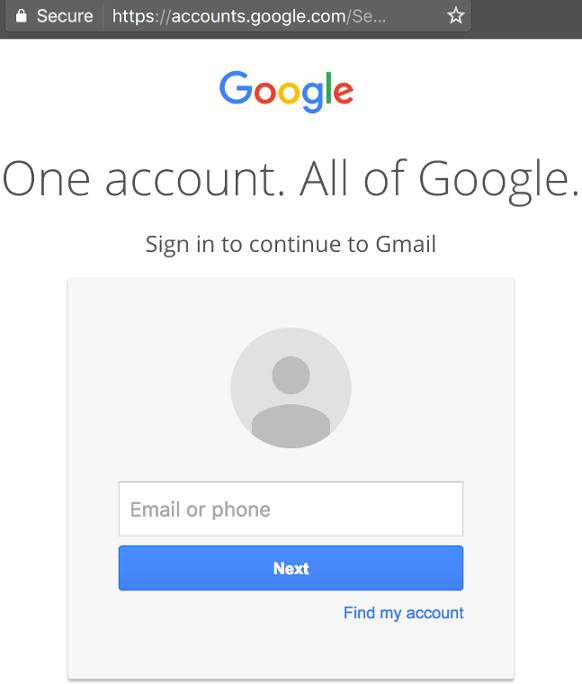
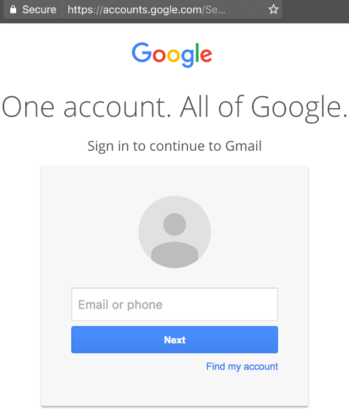
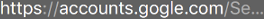

<!-- TOC depthFrom:1 depthTo:2 withLinks:1 updateOnSave:1 orderedList:0 -->

- [Motivation](#motivation)
- [Terms](#terms)
	- [Phishing](#phishing)
	- [Two-Factor Authentication (2FA)](#two-factor-authentication-2fa)
	- [Universal 2nd Factor (U2F)](#universal-2nd-factor-u2f)
	- [U2F Keys](#u2f-keys)
- [Background](#background)
	- [Problem to solve: Phishing](#problem-to-solve-phishing)
		- [What happened?](#what-happened)
	- [Motivation:](#motivation)
- [Sources](#sources)

<!-- /TOC --># Motivation

A simple, easy to understand document that aims to describe the problem of
[Phishing](#phishing), how using two-factor authentication helps defeat it, and
how physical security keys make Phishing impossible.

**It is targeted towards non-technical audience.**

Pull requests are welcome and encouraged.

# Terms

## Phishing

Phishing is the attempt to obtain sensitive information such as usernames,
passwords, and credit card details (and, indirectly, money), often for malicious
reasons, by disguising as a trustworthy entity in an electronic communication.

## Two-Factor Authentication (2FA)

Two-factor authentication (also known as 2FA) is a method of confirming a user's
claimed identity by utilizing a combination of two different components.

## Universal 2nd Factor (U2F)

Universal 2nd Factor (also known as U2F) is an open authentication standard that
strengthens and simplifies 2FA.

## U2F Keys

U2F Keys or Physical Security Keys are USB devices that provide a form of
identity verification for 2FA. It looks like this:


# Background

## Problem to solve: Phishing

### Good scenario

Let's say you want to read your Gmail emails, and let's assume that you do not
have 2FA enabled for your [Google](https://www.google.com) account.

Here's what you would do:

1. Open ```www.google.com/mail```
1. You are asked to login into your Google account.
1. You enter your username.
1. You enter your password.
1. You are shown your Gmail emails.



*Scenario 1: Google Login Page*

### Bad scenario

Now consider another scenario. You cousin Vinny sends you an email that contains
a link to a **free lottery to win an iPad**. When you click on the link, you are
shown a similar login page and here's what happens:

1. The link goes to ```www.gogle.com```
1. You are asked to login into your Google account.
1. You enter your username.
1. You enter your password.
1. Something happens. For instance, you may be told that your email address has
been entered in a raffle to win the promised iPad.



*Scenario 2: Gogle Login Page*

### Wait, why was that bad!?

Did you notice the missing ```o``` there in the website name in the URL?
Let's take a closer look.



*Did you intend to enter your Google credentials (username and password) on Gogle.com?*

Here's what may have happened in the background:

1. You entered your Google credentials on ```gogle.com```.
1. Now the owner of ```gogle.com``` has your Google credentials.
1. They can now use those credentials to login on Google as you and do bad things such as read your email, send email as you (to your contacts or other people), etc.

## Motivation:
<https://github.com/aawc/Enigma2017Notes#security-in-the-wild-for-low-profile-activists>

- How do security keys work?

  - <http://www.explainthatstuff.com/how-security-tokens-work.html>
  - <https://www.yubico.com/about/background/fido/>
  - <https://www.facebook.com/notes/facebook-security/security-key-for-safer-logins-with-a-touch/10154125089265766>
  - http://heatherandwill.io/key

# Sources

- <https://en.wikipedia.org/wiki/Multi-factor_authentication>
- <https://en.wikipedia.org/wiki/Universal_2nd_Factor>
- U2F image source: [LogicLounge](https://www.youtube.com/watch?v=EVx3QkJ8_J0)
